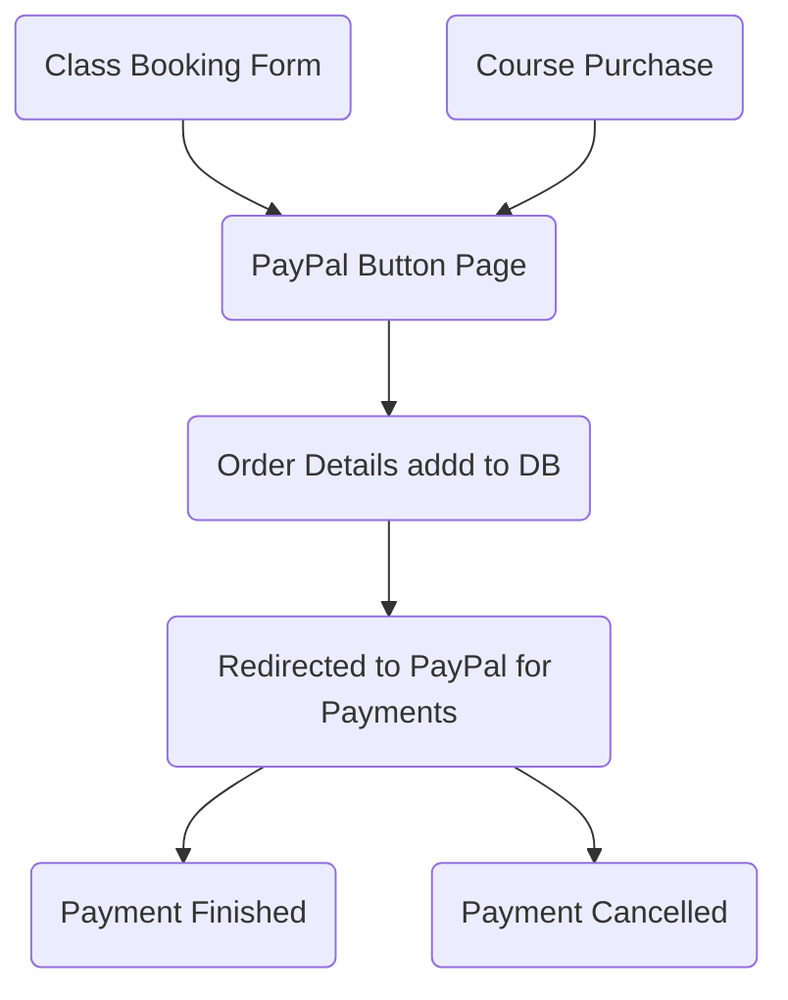
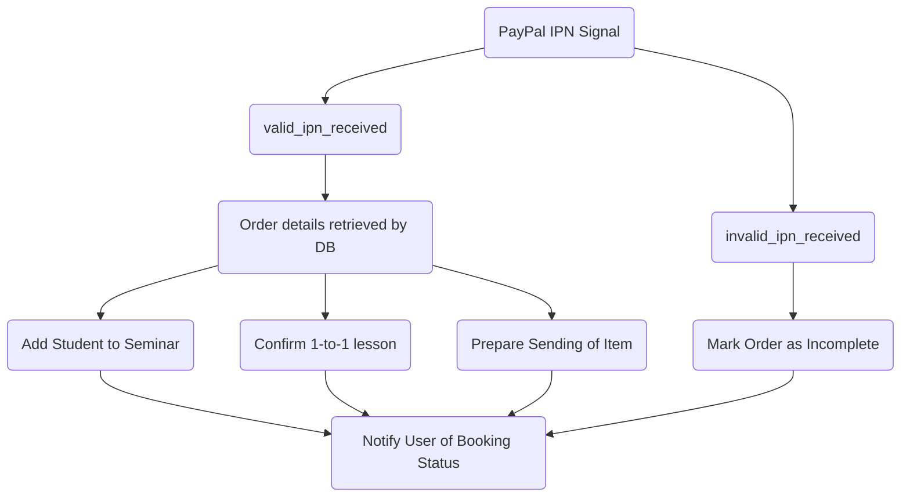

Payments
===

Payments are made on the wesite using paypal and through the use of [django-paypal](https://django-paypal.readthedocs.io/en/stable/index.html)

Paypal
---
- Sandbox for simulating requests
- Uses IPN signals to confirm payment status after attempted payment

Process
---

1. Signup / Purchase Form

2. Reacting to Paypal IPN Signals

